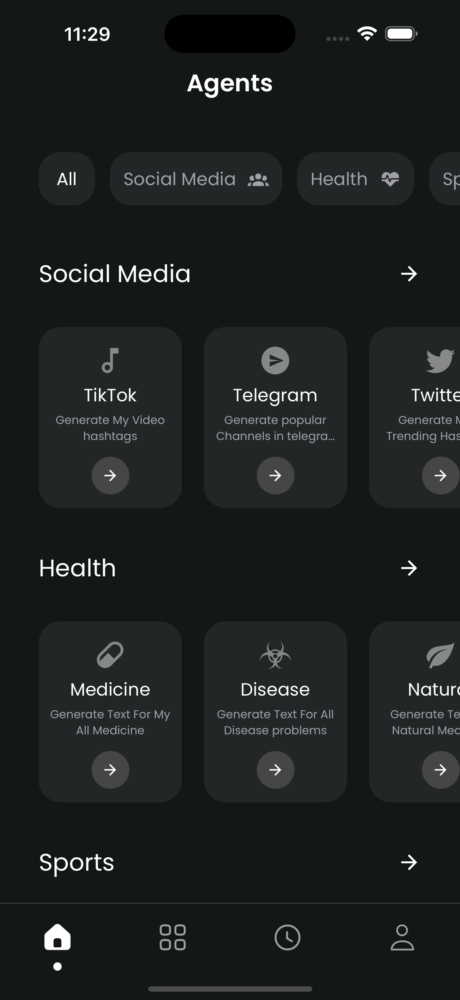
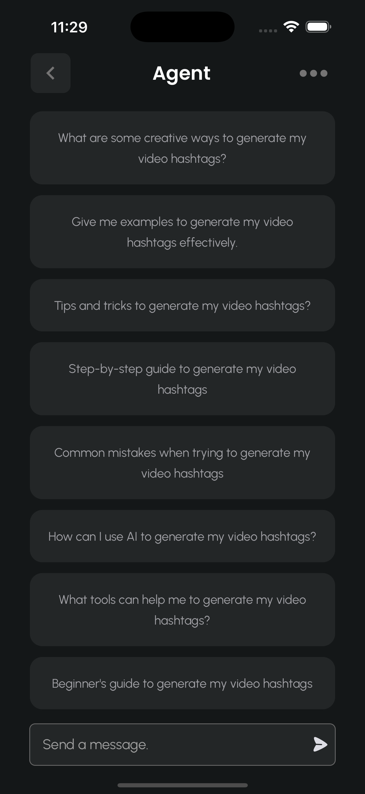
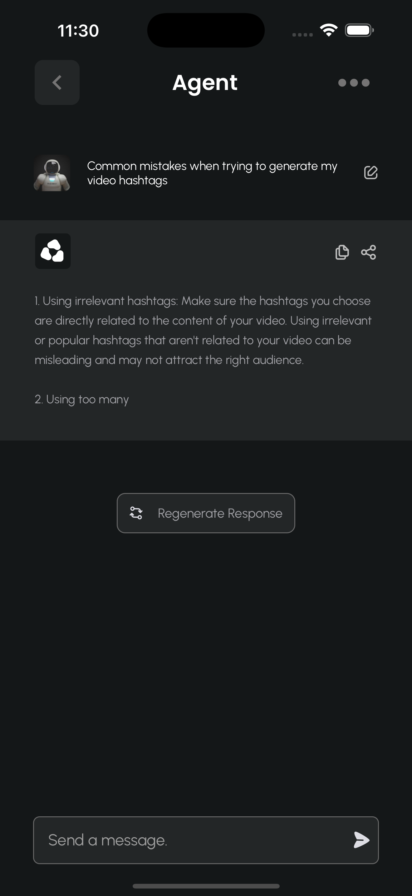
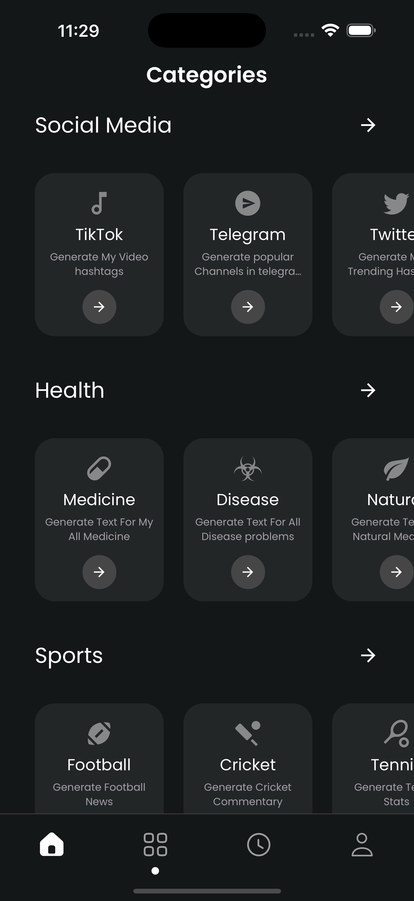
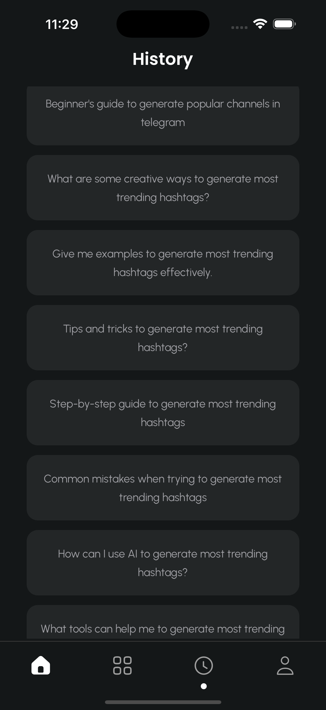
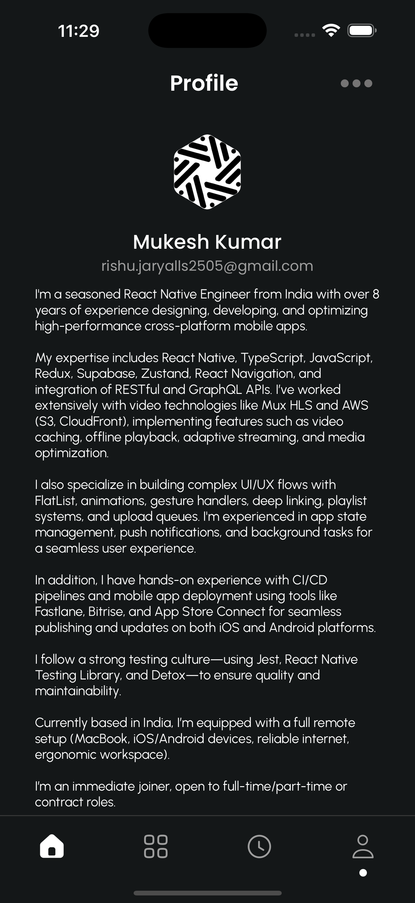

# Sentient Mobile App (Expo + Zustand + OpenAI)

This is a React Native mobile application built with **Expo** for the [Sentient Mobile Assignment](https://zenith-carol-301.notion.site/Sentient-Mobile-Assignment-210d4609dd4180b48c55ddafc0deb696). It provides a pixel-perfect dark-themed UI, a categorized list of AI agents, and a dynamic chat interface powered by the OpenAI API.

---

## 📸 Screenshots

### Agents


### Agent Home


### Agent Chat Interface


### Categories


### History


### Profile


---

## ⚙️ Tech Stack

- **Expo** (React Native framework)
- **TypeScript**
- **Zustand** (local + persisted state)
- **FlashList** (high-performance list)
- **React Native Reanimated** (animations)
- **OpenAI API** (dynamic chat responses)
- **React Native Paper** (UI components and icons)

---

## 🚀 Features

### 🔮 AI Chat
- Chat with AI agents using real-time OpenAI API.
- Typing animation and loader while AI is generating a response.
- Messages are persisted locally per agent using Zustand.

### 🧠 Agents Directory
- Scrollable list of agents grouped by categories.
- Supports filtering and animated chips.
- Fully dark-mode UI matching Figma spec.

### 💬 Chat Interface
- Sender/receiver bubbles
- Regenerate button
- AI typing simulation

### 🧱 State Management
- Zustand handles:
  - Chat history
  - Selected category
  - Agent metadata
- Persisted to disk using middleware

---

## 📁 Project Structure

```
project/
  - App.tsx
  - app.json
  - babel.config.js
  - jest.setup.js
  - metro.config.js
  - package.json
  - tsconfig.json
  - .env
  - .gitignore

  ├── assets/              # Fonts, images, icons
  ├── src/
  │   ├── components/      # Reusable UI elements
  │   ├── screens/         # Screens (Home, Profile, Chat, etc.)
  │   ├── navigation/      # Navigation stacks
  │   ├── stores/          # Zustand stores (e.g., useChatStore.ts)
  │   ├── hooks/           # Custom React hooks
  │   ├── utils/           # Prompt utils, response utils
  │   ├── types/           # TypeScript type definitions
  │   └── consts/          # Constants and static configs
```

---

## 🛠️ Setup

### 🔐 Prerequisites

1. Node.js 18+
2. Expo CLI
3. OpenAI API Key

### 📦 Installation

```bash
git clone https://github.com/Rishu2505/Sentient.git
cd sentient
npm install
```

### 🔑 Set OpenAI API Key

Create a `.env` file in the root:

```env
OPENAI_API_KEY=your-openai-api-key
```

> Your key will be used to dynamically fetch responses in the agent chat.

---

## ▶️ Running the App

```bash
npx expo start
```

Scan the QR code with **Expo Go** or launch on a simulator.

---

## 🔍 OpenAI API Usage

Chat responses are fetched dynamically using OpenAI’s GPT model. The prompt is constructed based on the agent’s configuration and the user's question. Zustand handles message persistence per agent.

---

## 📈 Possible Improvements

- Offline caching
- User-auth & saved chat history in backend
- In-app agent editing
- Voice assistant integration

---

## 👤 Author

**Mukesh Kumar**  
Senior React Native Engineer  
[LinkedIn](https://www.linkedin.com/in/your-profile](https://www.linkedin.com/in/mukesh-kumar-a07453199)) | [Portfolio](https://github.com/your-username](https://portfolio-lake-three-21.vercel.app/))

---

## 📜 License

This project is for assessment/demo purposes only.
